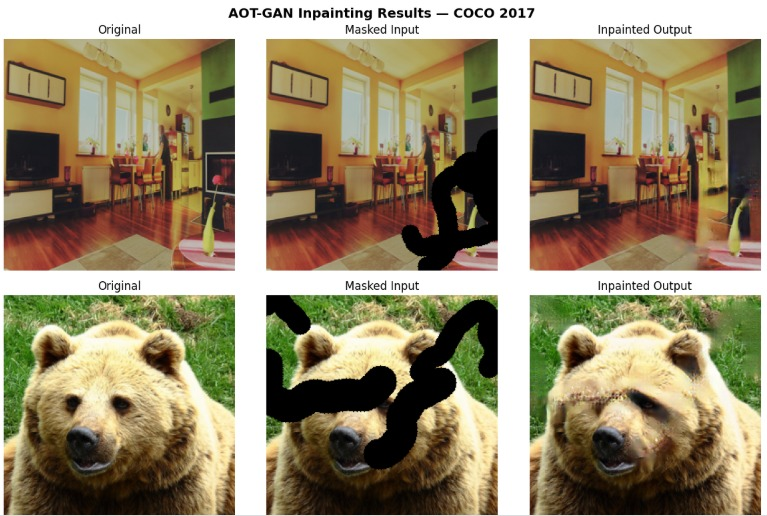

# Image Inpainting using AOT-GAN

Fine-tuning AOT-GAN (Aggregated Contextual Transformations GAN) 
on COCO 2017 dataset for image inpainting.

## 📌 Project Overview
This project implements image inpainting using GAN-based deep learning.
Two models are compared:
- Baseline GAN trained from scratch
- Pretrained AOT-GAN fine-tuned on COCO 2017

## 🏗️ Architecture
- **Model**: AOT-GAN (Aggregated Contextual Transformations GAN)
- **Attention**: Attention-over-Attention blocks for long-range dependencies
- **Training**: Two-phase (generator warmup + full GAN training)
- **Loss**: L1 reconstruction + Hinge adversarial loss

## 📊 Dataset
- **Training**: MS-COCO 2017 (5000 images)
- **Validation**: MS-COCO 2017 (500 images)
- **Pretrained weights**: AOT-GAN pretrained on Places2

## 📈 Results

| Model | PSNR (dB) | SSIM | LPIPS |
|---|---|---|---|
| Baseline GAN | 21.01 ± 2.48 | — | 0.1510 |
| AOT-GAN (Ours) | 21.71 ± 3.76 | 0.7854 ± 0.0942 | 0.1457 ± 0.0671 |

## 🖼️ Sample Results


## 🛠️ Tech Stack
- Python 3.12
- PyTorch 2.10
- CUDA (GPU training)
- OpenCV, PIL
- LPIPS, scikit-image

## 📋 Requirements
```
torch
torchvision
opencv-python
pillow
matplotlib
numpy
lpips
scikit-image
tqdm
```

## 🚀 How to Run
1. Open the notebook on Kaggle
2. Add COCO 2017 dataset as input
3. Add pretrained AOT-GAN weights as input
4. Run all cells

## 🔗 Links
- [Kaggle Notebook](https://www.kaggle.com/code/sarikajs/aot-gan-image-inpainting)
  
## 📚 Reference
Zeng et al. "Aggregated Contextual Transformations for 
High-Resolution Image Inpainting." arXiv:2104.01431 (2021)

## 👤 Author
Sarika J S
Internship at HIGBEC PVT LTD
